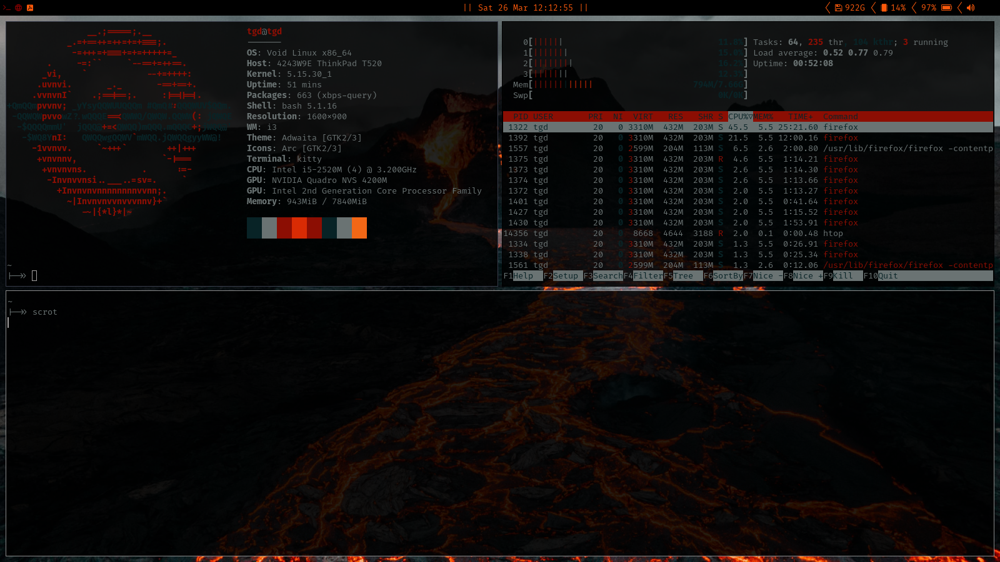

# Red Void

The above is a screenshot of these files applied to a Lenovo T520 Laptop.  I
have been writing a number of these files for a while and wanted to make a
reasonable way to deploy and share them.

# :floppy_disk: Installation
:exclamation: Please note, this isnstallation will write over:
1) `~/.config/i3`
2) `~/.config/kitty`
3) `~/.config/nvim`
4) `~/.config/rofi`
5) `~/.bashrc`
6) `~/.xinitrc`

If you wish to back these up, do it before running the install script!

The installation script installs all programs specified in packages.txt using
the `xbps-install` command. In order to best fir your needs, you can edit this
file to reflect what packages you want (one common thing that I do not have is
any graphics drivers, please see the
[void docs](https://docs.voidlinux.org/config/graphical-session/graphics-drivers/index.html)
to see if you need any).

<em>When you have backed up your files<\em> and edited packages.txt to fit your
needs, installation is completed using:

```
sudo install.sh
```

I will say that on a fresh install of base void linux, it is unlikely for
this script to fail or cause any problems (at least on all my machines).

# :sunny: Explanation of Dot Files
These files set up the working environment that I use for my daily work
activites. The following are some system commends (mod is windows key in my
config):

| Command      |           Usage          |
|--------------|--------------------------|
|`mod+z`       | Switch to workspace 1    |
|`mod+x`       | Switch to workspace 2    |
|`mod+c`       | Switch to workspace 3    |
|`mod+v`       | Switch to workspace 4    |
|`mod+b`       | Switch to workspace 5    |
|`mod+n`       | Switch to workspace 6    |
|`mod+q`       | Quit Current Window      |
|`mod+Enter`   | Start New Kitty Terminal |
|`mod+w`       | Start Firefox            |

This makes switching workspaces fast once you get used to it.


# Other Notes
Note that kitty will complain because of the bashrc. I have a custom terminal
program that writes custom art and quotes to the terminal. If you would like you
can go to my terminal rice repository and make the binary to run it. Otherwise,
just remove those lines from the bashrc to get rid of the errors (an easy patch
is to replace the last three lines of the bashrc with just `neofetch` to display
system info on startup of a terminal).
